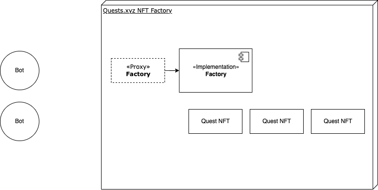

# Quests NFT

A key feature of [Quests.com](https://quests.com/), a platform for creating
a socially-verified portfolio of work, is the commemorative Quest NFT.

This token is minted and distributed to all contributors at the end of a quest
to represent their unique contribution. Combined, a collection of Quest NFTs
make up a contributor's body of work.

## System Overview

This system has two main components: a factory contract and a quest NFT
contract:

The Factory implementation ( [`src/Factory.sol`](./src/Factory.sol) ) is where
instances of a Quest NFT ([`src/Quest.sol`](./src/Quest.sol)) are created at the
end of a project. Quest NFTs can only be created or updated by admins on the
Factory contract.

## Contracts

### [`Factory.sol`](./src/Factory.sol)

The Factory contract is used to create instances of the Quest NFT - one per
project in quests.com - and manage a list of permissioned wallets.

A quest can be created with the `createQuest` method, which will create a new
instance of `Quest.sol` with the provided data (name, symbol, contributors,
token URI, and contract URI). A quest can only be created by an admin.

The Factory stores a list of admins using OpenZeppelin's `AccessControl` and has
an owner address using `Ownable2Step`. The contract owner can grant the admin
role to an address. The admin role is required to create a new quest or update
an existing quest.

### [`Quest.sol`](./src/Quest.sol)

The majority of the system's logic is in the `Quest` contract.

The admin role on the Factory contract is required to create a new quest or
update an existing quest (`Quest.sol` checks for the admin role on
`Factory.sol`).

The contract is a fairly standard NFT contract with a couple of important
considerations:

- Most actions are gated to admins on the `Factory.sol` contract.
- `transferFrom` is a shadow implementation of `ERC721.sol#transferFrom` by solmate that skips checking for approval. This is okay since only addresses with the admin role on `Factory.sol` can mint, burn, and transfer tokens.
- The contract maps addresses to IDs (like most NFT contracts) and data about the quest is stored off-chain on IPFS.

## License

This project is licensed under MIT. See [`LICENSE`](./LICENSE) for more details.
